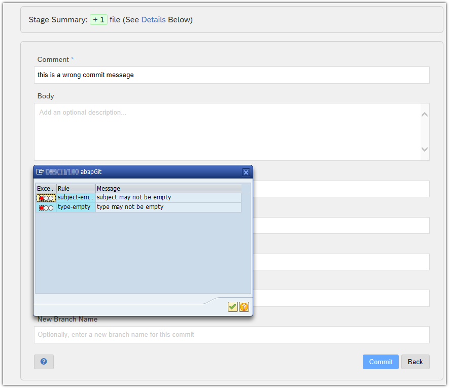
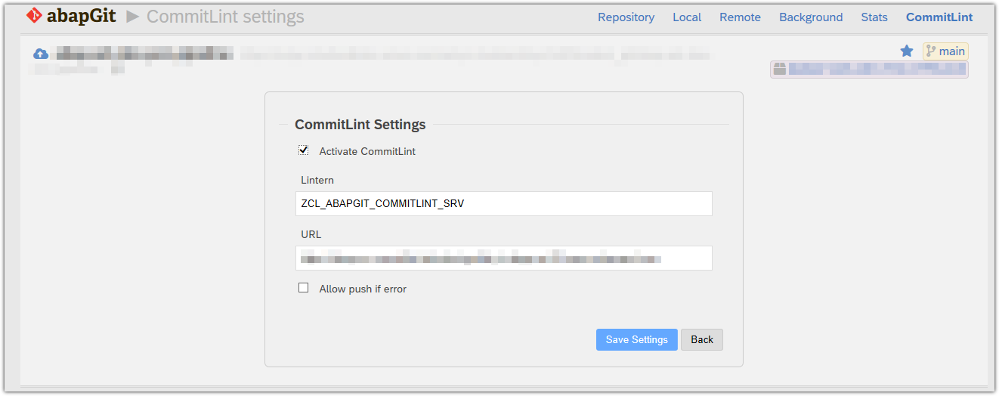

# abapgit-commitlint
This repo allows abapGit to check if commit message complies with the commit rules defined per each repo.

## Installation
use [abapgit](https://github.com/abapGit/abapGit) for installing this repo

## Considerations
This repo uses following [abapgit UserExits](https://docs.abapgit.org/ref-exits.html):
* **VALIDATE_BEFORE_PUSH**: just before pushing changes into remote repo, it executes ZCL_ABAPGIT_COMMITLINT and if errors a popup is shown while canceling that Push.

```abap
METHOD zif_abapgit_exit~validate_before_push.
    TRY.
        DATA(lo_commit_linter)     = zcl_abapgit_commitlint=>get_linter( io_repo ).

        IF lo_commit_linter IS BOUND.
          DATA(lo_commitlint_engine) = NEW zcl_abapgit_commitlint( is_comment        = is_comment
                                                                   io_repo           = io_repo
                                                                   io_linter         = lo_commit_linter ).
          lo_commitlint_engine->validate( ).
          IF lo_commitlint_engine->has_errors(  ) = abap_true.
            zcl_abapgit_commitlint_ui=>display_log( lo_commitlint_engine->get_log( ) ).

            IF zcl_abapgit_commitlint=>is_push_allowed_with_errors( io_repo ) = abap_false.
              "Abort commit
              zcx_abapgit_exception=>raise(
                EXPORTING
                  iv_text = 'Commit message does not stick to the rules.' ).
            ENDIF.
          ENDIF.
        ENDIF.

      CATCH zcx_abapgit_commitlint INTO DATA(lo_exception).
        zcx_abapgit_exception=>raise(
          EXPORTING
            iv_text     = lo_exception->get_text( )
            ix_previous = lo_exception ).
    ENDTRY.

  ENDMETHOD.
```



* **ENHANCE_REPO_TOOLBAR**: adds a new abapGit page in repo settings so that you could decide per each repo which rules to check and how to behave if any is not correct.

```abap
  METHOD zif_abapgit_exit~enhance_repo_toolbar.

    io_menu->add( iv_txt = 'CommitLint'
                  iv_act = |{ zcl_abapgit_commitlint_page=>mc_id }?key={ iv_key }|
                  iv_cur = boolc( iv_act = zcl_abapgit_commitlint_page=>mc_id ) ).

  ENDMETHOD.

```


  * **Linter**: just specify an ABAP class that implements ZIF_ABAPGIT_COMMIT_LINTER which will be responsible of executing the desired Lintern.
  * **URL**: url where the linter service is running (see [abap-srv-commitlint](https://github.com/rayatus/abap-srv-commitlint))

By default, this repo uses an implementation of [conventional commit](https://www.conventionalcommits.org/) so ZCL_ABAPGIT_COMMITLINT instantiates ZCL_ABAPGIT_COMMITLINT_SRV which executes a NodeJS application (see [abap-srv-commitlint](https://github.com/rayatus/abap-srv-commitlint)) where the rule validations are executed.

## Dependencies
* [abapgit](https://github.com/abapGit/abapGit)
* [abap-srv-commitlint](https://github.com/rayatus/abap-srv-commitlint)
